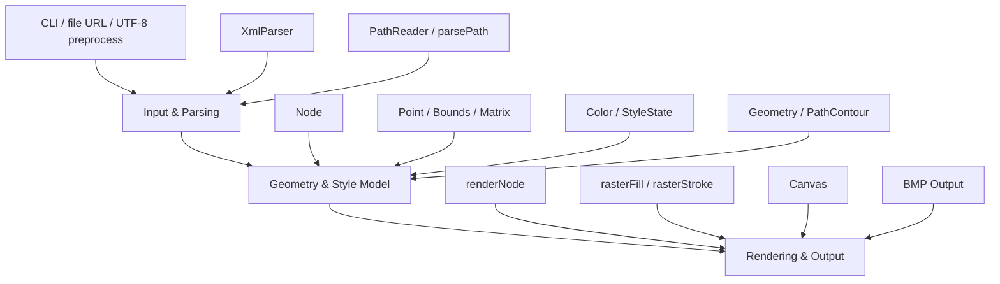
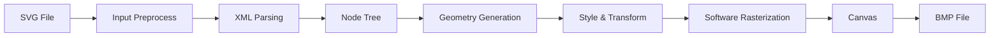

# 2026dian
Dian Team Project Responsitory
# SVG Painter

一个使用**仓颉语言**实现的轻量级 SVG 解析与渲染工具。  
程序可从命令行读取 SVG 文件，并在原文件所在目录输出同名 `BMP` 位图文件。

> 该项目实现了从 **SVG/XML 解析 → 几何建模 → 软件光栅化 → BMP 输出** 的完整流程。

---

## Features

- 使用仓颉语言实现
- 支持命令行传入 SVG 文件路径
- 自动输出同目录同名 `.bmp`
- 保持原图宽高比
- 输出图像短边不少于 `1000px`
- 基于软件光栅化，无外部图形引擎依赖

### Supported SVG Elements

- `svg`
- `g`
- `defs`
- `symbol`
- `use`
- `rect`
- `circle`
- `ellipse`
- `line`
- `polyline`
- `polygon`
- `path`

### Supported Style / Attributes

- `fill`
- `stroke`
- `stroke-width`
- `opacity`
- `fill-opacity`
- `stroke-opacity`
- `fill-rule`
- `transform`
- `display`
- `visibility`
- `viewBox`
- `preserveAspectRatio`

### Supported Path Commands

- `M/m`
- `L/l`
- `H/h`
- `V/v`
- `C/c`
- `S/s`
- `Q/q`
- `T/t`
- `A/a`
- `Z/z`

---

## Project Structure

```text
.
├─ src/
│  └─ main.cj
├─ cjpm.toml
├─ cjpm.lock
└─ README.md
```

---

## Architecture

整个程序可以划分为 3 个核心模块：

### 1. Input & Parsing

负责：

- 命令行参数处理
- `file:///...` URL 输入兼容
- UTF-8 输入预处理
- XML/SVG 结构解析
- path 数据解析

主要组件：

- `normalizeInputArg`
- `utf8ToAsciiView`
- `XmlParser`
- `PathReader`
- `parsePath`

### 2. Geometry & Style Model

负责：

- SVG 节点树建模
- 图元统一几何表达
- 样式状态管理
- 矩阵变换与包围盒计算

主要数据结构：

- `Node`
- `Point`
- `Bounds`
- `Matrix`
- `Color`
- `StyleState`
- `Geometry`
- `PathContour`

### 3. Rendering & Output

负责：

- 样式继承与变换应用
- 填充与描边渲染
- 像素混合
- BMP 编码输出

主要组件：

- `renderNode`
- `renderGeometry`
- `rasterFill`
- `rasterStroke`
- `Canvas`
- `Canvas.saveBmp`

---

## Module Diagram



## Data Flow



---

## Build

在项目根目录执行：

```powershell
cjpm build
```

---

## Usage

### Run with a normal file path

```powershell
cjpm run -- "C:\path\to\demo.svg"
```

或者直接运行生成的可执行文件：

```powershell
.\target\release\bin\main.exe "C:\path\to\demo.svg"
```

### Run with `file:///...` URL

如果输入路径包含中文或特殊字符，推荐使用 `file:///...` URL 形式：

```powershell
cjpm run -- "file:///C:/Users/wh070/Desktop/2-cangjie.svg"
```

程序执行成功后会输出：

```text
done
```

并在 SVG 所在目录生成同名 BMP 文件，例如：

```text
2-cangjie.svg  ->  2-cangjie.bmp
```

---

## Output Rules

- 输出格式：`BMP`
- 输出目录：输入 SVG 所在目录
- 输出文件名：与输入 SVG 同名，仅扩展名改为 `.bmp`
- 保持原图宽高比
- 输出图像短边不少于 `1000px`

---

## Rendering Strategy

本项目采用**软件渲染**方式：

- 将 SVG 图元转换为统一几何轮廓
- Bézier 曲线与椭圆弧通过分段采样逼近
- 对填充区域使用点包含测试
- 对描边使用点到线段距离测试
- 使用局部包围盒优化遍历范围
- 使用简单超采样实现抗锯齿

---

## Limitations

当前版本为轻量级实现，尚未支持以下高级 SVG 特性：

- 渐变（gradient）
- 文本排版（text）
- 图片嵌入（image）
- `clipPath`
- `mask`
- `filter`
- 完整 CSS 样式系统
- 高级描边端点/连接风格

---

## Main Source File

- `src/main.cj`

---

## Example

```powershell
cd "C:\Users\wh070\Documents\New project"
cjpm build
cjpm run -- "file:///C:/Users/wh070/Desktop/2-cangjie.svg"
```

---

## License

This project is provided for learning, experimentation, and SVG rendering task practice.
